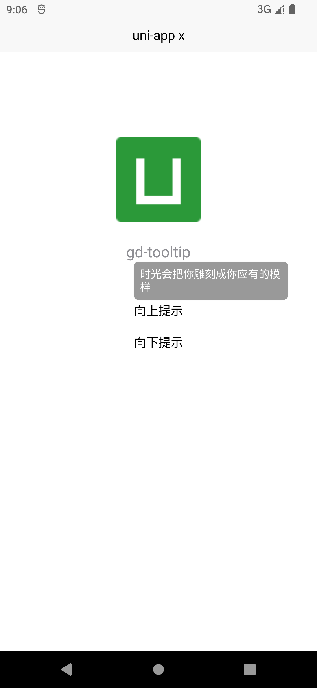
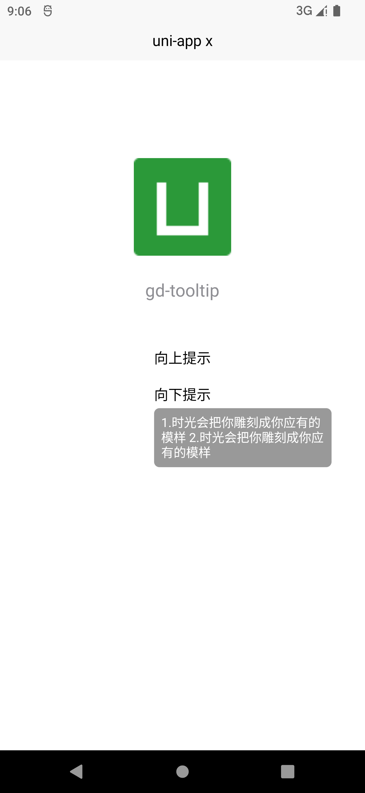

# gd-tooltip

本组件类似 [uni-tooltip](https://uniapp.dcloud.net.cn/component/uniui/uni-tooltip.html)，但是适用于 uni-app x。

## 介绍

### 安装方式

本组件符合 [easycom](https://uniapp.dcloud.io/collocation/pages?id=easycom) 规范，`HBuilderX 2.5.5`起，只需将本组件导入项目，在页面 `template` 中即可直接使用，无需在页面中 `import` 和注册 `components`。

### 基本用法

在  `template`  中使用组件

```vue
<gd-tooltip content="时光会把你雕刻成你应有的模样" placement="top">
    <text>向上提示</text>
</gd-tooltip>
```

## 图示





## API

### Tooltip Props

|     属性名     |  类型  |   默认值    |               备注               |
| :------------: | :----: | :---------: | :------------------------------: |
|    content     | String |             |         弹出层显示的内容         |
|    maxWidth    | Number |    200px    |          弹出层最大宽度          |
|   background   | String |   #999999   |            弹出层背景            |
|     radius     | Number |     6px     |      弹出层`border-radius`       |
|    padding     | Number |     8px     |         弹出层 `padding`         |
|     color      | String |   #FFFFFF   |       弹出层显示内容的颜色       |
|      size      | Number |    14px     |       弹出层显示内容的大小       |
| maskBackground | String | transparent |            遮罩层背景            |
|   placement    | String |     top     | 弹出层位置，可选 `top`，`bottom` |
|     zIndex     | Number |     990     |         弹出层 `z-index`         |

### Tooltip Slots

|  名称   |         说明          |
| :-----: | :-------------------: |
| default | 被 Tooltip 包裹的组件 |

## 示例

```vue
<template>
	<view class="content">
		<image class="logo" src="/static/logo.png"></image>
		<view class="text-area">
			<text class="title">{{title}}</text>
		</view>

		<view style="margin-top: 100rpx;">
			<view>
				<gd-tooltip content="时光会把你雕刻成你应有的模样" placement="top">
					<text>向上提示</text>
				</gd-tooltip>
			</view>

			<view style="margin-top: 40rpx;">
				<gd-tooltip>
					<gd-tooltip content="1.时光会把你雕刻成你应有的模样 2.时光会把你雕刻成你应有的模样" placement="bottom">
						<text>向下提示</text>
					</gd-tooltip>
				</gd-tooltip>
			</view>
		</view>
	</view>
</template>

<script>
	export default {
		data() {
			return {
				title: 'gd-tooltip'
			}
		},
		onLoad() {

		},
		methods: {

		}
	}
</script>

<style lang="scss" scoped>
	.content {
		display: flex;
		align-items: center;
		justify-content: center;
	}

	.logo {
		height: 200rpx;
		width: 200rpx;
		margin-top: 200rpx;
		margin-bottom: 50rpx;
	}

	.title {
		font-size: 36rpx;
		color: #8f8f94;
	}
</style>
```

